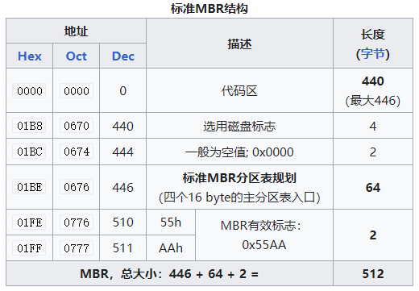
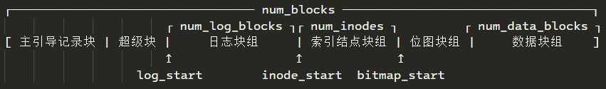

# FTOS文件系统设计与实现

## 代码目录结构

```shell
/home/user/Desktop/lib14/src/fs
├── block_device.c  ──── 块设备定义
├── block_device.h  ──── 块设备定义头文件
├── cache.c         ──── 缓存定义
├── cache.h         ──── 缓存定义头文件
├── CMakeLists.txt  ──── CMake文件
├── defines.h       ──── 相关通用结构及常量定义
├── file.c          ──── 文件
├── file.h          ──── 文件
├── fs.c            ──── 文件系统
├── fs.h            ──── 文件系统
├── inode.c         ──── i结点
├── inode.h         ──── i结点
├── README.md       ──── 说明
└── test            ──── 测试文件夹
```

## 系统概述

FTOS的文件系统是简易文件系统(SFS)，

### 组成

#### 基本定义

磁盘布局及各部分说明如下所示：

`[ 主引导记录块 | 超级块 | 日志块组 | 索引结点块组 | 位图块组 | 数据块组 ]`

* 主引导记录块(MBR block)：

    主引导记录块一般是指计算机开机后访问硬盘时所必须要读取的首个大小为512Kb的块（扇区），其标准结构如下所示：

    

    MBR的内容以及功能并不是要讨论的范围，因此直接跳过。

    &emsp;

* 超级块(super block)：

    FTOS的超级块只有一个，且大小固定，用于描述磁盘布局，`lib14/src/fs/defines.h`中的数据结构定义如下所示：

    ```c
    typedef struct {
        u32 num_blocks;  // 文件系统的块总数
        u32 num_data_blocks; // 数据块总数
        u32 num_inodes; // 索引结点块总数
        u32 num_log_blocks;  // 日志块总数，包含日志头
        u32 log_start;       // 日志块组的起始块位置
        u32 inode_start;     // 索引结点块组的起始块位置
        u32 bitmap_start;    // 位图块组的起始块位置
    } SuperBlock;
    ```

    效果如下：

    

    &emsp;

* 日志块组(Log Blocks)：

    &emsp;

* 索引结点块组(inode blocks)：

    1. 数据结构

        索引结点块根据实际索引结点类型的不同定义了相应的数据结构：

        索引结点类型(对应编号)：

        0 - INODE_INVALID：无效的索引结点
        1 - INODE_DIRECTORY：目录类型的索引结点
        2 - INODE_REGULAR：一般的索引结点
        3 - INODE_DEVICE：

        磁盘索引结点(dinode)：

        ```c
        typedef struct dinode {
        InodeType type;
        u16 major;                    // major device id, for INODE_DEVICE only.
        u16 minor;                    // minor device id, for INODE_DEVICE only.
        u16 num_links;                // number of hard links to this inode in the filesystem.
        u32 num_bytes;                // number of bytes in the file, i.e. the size of file.
        u32 addrs[INODE_NUM_DIRECT];  // direct addresses/block numbers.
        u32 indirect;                 // the indirect address block.
        } InodeEntry;
        ```

    2. 功能函数

        * alloc
        * lock
        * unlock
        * sync
        * get
        * clear
        * share
        * put
        * read
        * write
        * lookup
        * insert
        * remove

* 位图块组(bitmap blocks)：

    通过位图表示块的使用情况

    &emsp;

* 数据块组(data blocks)：

    &emsp;

#### 块操作

#### 文件操作

在底层结构的基础上，进一步抽象出对文件及相应的操作函数。

文件的组织结构如下所示：

```c
typedef struct file {
    enum { FD_NONE, FD_PIPE, FD_INODE } type; // 文件类型
    int ref; // 引用次数
    char readable; // 是否可读
    char writable; // 是否可写
    struct pipe *pipe; // 管道定义（文件类型是FD_PIPE时有效）
    Inode *ip; // 索引结点定义（文件类型是FD_INODE时有效）
    usize off; // 文件偏移大小
} File;
```

功能函数如下所示：

* void fileinit()

    初始化文件结构

* struct file *filealloc()

    分配一个文件结构

* struct file *filedup(struct file \*f)

    复制文件f，实际上是f的文件引用次数加1

* void fileclose(struct file \*f)

    关闭文件f，实际上是f的文件引用次数减1，当文件引用次数为0时关闭文件

* int filestat(struct file \*f, struct stat \*st)

    获取文件f的元信息，存储到st中

* isize fileread(struct file \*f, char \*addr, isize n)

    从文件f中读取信息到addr处，读取大小为n

* isize filewrite(struct file \*f, char \*addr, isize n)

    从addr处写入信息到文件f处，写入大小为n

#### 系统调用

* int sys_dup()
* isize sys_read()
* isize sys_write()
* isize sys_writev()
* int sys_close()
* int sys_fstat()
* int sys_fstatat()
* int sys_openat()
* int sys_mkdirat()
* int sys_mknodat()
* int sys_chdir()
* int sys_exec()

### 运行逻辑

#### 初始化

#### 文件创建

#### 文件打开

#### 文件读取

#### 文件写入

#### 文件运行

#### 文件复制

#### 文件删除

&emsp;
