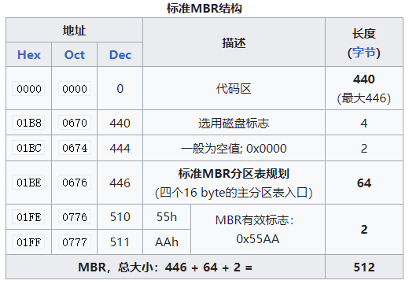

# FTOS文件系统设计与实现

## 代码目录结构

```shell
/home/user/Desktop/lib14/src/fs
├── block_device.c  ──── 块设备定义
├── block_device.h  ──── 块设备定义头文件
├── cache.c         ──── 缓存定义
├── cache.h         ──── 缓存定义头文件
├── CMakeLists.txt  ──── CMake文件
├── defines.h       ──── 相关通用结构及常量定义
├── file.c          ──── 文件
├── file.h          ──── 文件
├── fs.c            ──── 文件系统
├── fs.h            ──── 文件系统
├── inode.c         ──── i结点
├── inode.h         ──── i结点
├── README.md       ──── 说明
└── test            ──── 测试文件夹
```

## 系统概述

FTOS的文件系统是简易文件系统(SFS)，

### 组成

#### 基本定义

磁盘布局及各部分说明如下所示：

`[ 主引导记录块 | 超级块 | 日志块组 | 索引结点块组 | 位图块组 | 数据块组 ]`

* 主引导记录块(MBR block)：

    主引导记录块一般是指计算机开机后访问硬盘时所必须要读取的首个大小为512Kb的块（扇区），其标准结构如下所示：

    

    MBR的内容以及功能并不是要讨论的范围，因此直接跳过。

    &emsp;

* 超级块(super block)：

    FTOS的超级块只有一个，且大小固定，用于描述磁盘布局，`lib14/src/fs/defines.h`中的数据结构定义如下所示：

    ```c
    typedef struct {
        u32 num_blocks;  // 文件系统的块总数
        u32 num_data_blocks; // 数据块总数
        u32 num_inodes; // 索引结点块总数
        u32 num_log_blocks;  // 日志块总数，包含日志头
        u32 log_start;       // 日志块组的起始块位置
        u32 inode_start;     // 索引结点块组的起始块位置
        u32 bitmap_start;    // 位图块组的起始块位置
    } SuperBlock;
    ```

    效果如下：

    

    &emsp;

* 日志块组(Log Blocks)：

    &emsp;

* 索引结点块组(inode blocks)：

    1. 数据结构

        索引结点块根据实际索引结点类型的不同定义了相应的数据结构：

        索引结点类型(对应编号)：

        + 0 - `INODE_INVALID`：无效的索引结点，表示该inode尚未分配
        + 1 - `INODE_DIRECTORY`：目录类型的索引结点，表示该inode代表的文件类型为目录
        + 2 - `INODE_REGULAR`：一般的索引结点，表示该inode代表的文件类型为一般文件
        + 3 - `INODE_DEVICE`：外设的索引节点，通常从键盘读取的输入与输出

        磁盘索引结点(dinode)：

        ```c
        typedef struct dinode {
        InodeType type;
        u16 major;                    // major device id, for INODE_DEVICE only.
        u16 minor;                    // minor device id, for INODE_DEVICE only.
        u16 num_links;                // number of hard links to this inode in the filesystem.
        u32 num_bytes;                // number of bytes in the file, i.e. the size of file.
        u32 addrs[INODE_NUM_DIRECT];  // direct addresses/block numbers.
        u32 indirect;                 // the indirect address block.
        } InodeEntry;
        ```

    2. 功能函数

        * `alloc`：分配一个inode。函数`inode_alloc`的主要工作是在磁盘中找到一个未分配的inode，然后将它的`type`字段设置为给定的文件类型，表示已分配，最后调用函数`get`，返回这个inode在内存中的拷贝。
        * `lock`：对inode得更改必须确保原子性，单个主体（进程）对inode进行更改之前，需要加锁。
        * `unlock`：预`lock`对应，表示解锁操作。
        * `sync`：将内存中的inode写入到磁盘，由于cache采用直写模式，因此当inode有字段被修改，就需要调用一次函数sync进行写回操作。
        * `get`：先在icache中根据标号inum寻找对应的inode。如果找到，则将其引用数`ref`字段加1并返回，否则在icache中回收一个空闲的`cache_entry`给这个inode，将其引用数ref设置为1并返回。
        * `clear`：用于清空inode的内容，包括`NDERECT`个直接索引磁盘块和`NINDIRECT`个间接索引磁盘块。
        * `share`：新增一个对inode的引用。
        * `put`：将inode的引用数减1。当引用减为0时，表示当前该文件没有被任意主题引用，inode将会被释放。
        * `read`：从 inode 中读取数据。总体来说，先确保数据的读取范围在文件内，然后利用函数 `inode_map` 定位文件中 block 的地址并读取到 `buf`，接着将数据从 `buf` 复制到目标地址 `dest`
        * `write`：写入数据到inode。具体来说，先确保数据的写入起始地址在文件内，且写入结束地址不超过最大文件大小 `INODE_MAX_BYTES`，然后利用函数 `inode_map` 定位文件中 block 的地址并读取到 `buf`，接着将数据从源地址 `src` 复制到 `buf`。其中，如果写入的 block 数量超过文件大小，文件将自动扩容，最后需要更新此文件的大小，并调用函数 inode_sync 写入到磁盘
        * `lookup`：函数在一个目录中搜索一个带有给定名称的条目
        * `insert`：会在当前目录中创建一个新的目录项，通过给定的名称和inode号。主循环读取目录项，寻找一个未使用的条目。当它找到一个时，它会提前跳出循环，并将 offset 设置为该可用条目的偏移量。`inode_insert`都会在偏移量off的位置添加一个新的条目到目录中
        * `remove`：仅用于目录，将目录索引inode移除。

* 位图块(bitmap blocks)：

    通过位图表示数据块的使用情况

    &emsp;

* 数据块(data blocks)：

    &emsp;

#### 块操作

#### 文件操作

在底层结构的基础上，进一步抽象出对文件及相应的操作函数。

文件的组织结构如下所示：

```c
typedef struct file {
    enum { FD_NONE, FD_PIPE, FD_INODE } type; // 文件类型
    int ref; // 引用次数
    char readable; // 是否可读
    char writable; // 是否可写
    struct pipe *pipe; // 管道定义（文件类型是FD_PIPE时有效）
    Inode *ip; // 索引结点定义（文件类型是FD_INODE时有效）
    usize off; // 文件偏移大小
} File;
```

功能函数如下所示：

* `void fileinit()`初始化文件结构

* `struct file filealloc()`分配一个文件结构

* `struct file filedup(struct file \*f)`复制文件f，实际上是f的文件引用次数加1

* `void fileclose(struct file \*f)`关闭文件f，实际上是f的文件引用次数减1，当文件引用次数为0时关闭文件

* `int filestat(struct file \*f, struct stat \*st)`获取文件f的元信息，存储到st中

* `isize fileread(struct file \*f, char \*addr, isize n)`从文件f中读取信息到addr处，读取大小为n

* `isize filewrite(struct file \*f, char \*addr, isize n)`从addr处写入信息到文件f处，写入大小为n

#### 系统调用

* int sys_dup()
* `isize sys_read()`：读文件，调用`fileread()`
* `isize sys_write()`：写文件，调用`filewrite()`
* `isize sys_writev()`：聚集写文件，调用`filewrite()`
* `int sys_close()`：关闭当前进程打开的文件
* `int sys_fstat()`：文件指针（`struct file*`）作参数，获取文件的元数据，调用`filestat()`
* `int sys_fstatat()`：文件路径作参数，获取文件的元数据
* `int sys_openat()`：文件路径作参数，打开文件
* `int sys_mkdirat()`：创建目录
* `int sys_mknodat()`：创建目录，和外设相关
* `int sys_chdir()`：切换目录
* `int sys_exec()`：执行文件

### 运行逻辑

+ 系统编译生成mkfs和其它用户程序。其中mkfs用于生成文件系统镜像fs.img，并将用户程序写入到镜像文件fs.img中。
+ 系统将文件系统镜像合并为硬盘镜像sd.img，qemu将其挂载到操作系统FTOS上。
+ 系统初始化文件系统和日志系统，为系统调用提供最底层的操作块设备的接口。

#### 文件系统初始化

文件系统通过mkfs生成文件系统镜像fs.img，步骤如下：

+ 初始化超级块，确定超级块各个字段和系统参数。超级块写入磁盘的第二个块中（块号为1）
+ 为根目录分配inode，其数据块包括当前目录`.`和父目录`..`。
+ 将用户程序写入磁盘中，更新位图，生成初始的文件系统镜像
+ 操作系统启动时，初始化块设备、日志系统、inode树。

#### 打开文件


* C语言调用`open`函数，将文件路径和打开方式作为参数传入
* 调用系统调用`sys_openat`。在`sys_openat`中，根据`open`函数的第二个参数判断打开文件方式
* 如果为创建`O_CREAT`，则调用`create`创建新文件，其中`create`将会调用底层`inode.alloc`分配一个新的inode。
* 否则将调用`namei`对文件路径进行递归查找，直到找到目标inode，调用`inode.share`将indoe的引用加1
* 调用`filealloc`，得到包含文件信息的文件结构；调用`fdalloc`，返回文件描述符

#### 创建目录

+ C语言调用`mkdir`函数，将文件路径作为参数传入
+ 调用系统调用`sys_mkdirat`
+ 调用`create`创建一个新的inode，参数为`INODE_DIRECTORY`,其中`create`将会调用底层`inode.alloc`分配一个新的inode

#### 读取文件

+ C语言调用`read`函数
+ 调用系统调用`sys_read`
+ 调用`fileread`，传入文件结构，获取文件对应的inode，再调用`inode.read`，读取数据块数据

#### 写入文件

+ C语言调用`write`函数
+ 调用系统调用`sys_write`
+ 调用`filewrite`，传入文件结构，获取文件对应的inode，再调用`inode.write`，向数据块写入

#### 运行文件

+ C语言调用`execve`函数
+ 系统调用`sys_exec`，文件路径作为参数传入
+ 系统调用`pgdir_init`初始化新的页表
+ 调用`namei`获取文件对应的inode
+ 调用`inode.read`读取数据块，得到ELF格式文件内容，并将程序加载到内存
+ 调用`uvm_alloc`为进程分配新的虚存，
+ 将参数入栈、字节对齐、分配用户栈，最后返回用户态